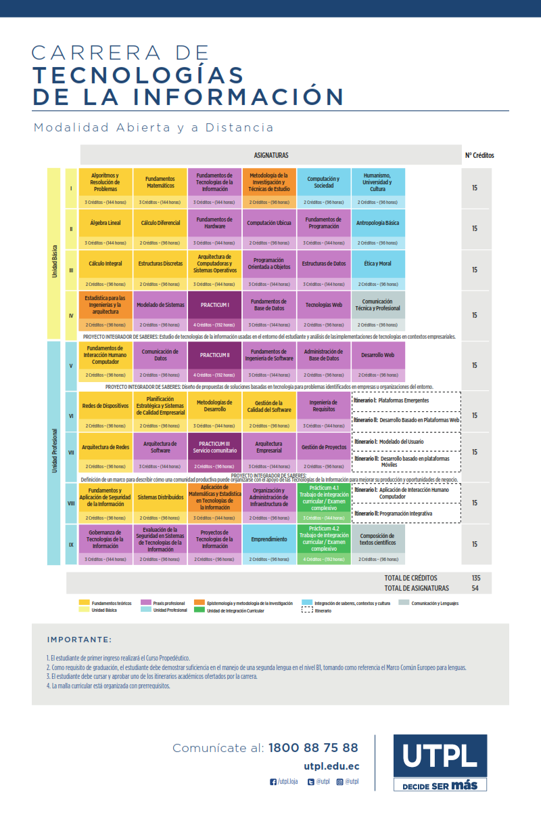

# Tecnología de la Información

La [Universidad Técnica Particular de Loja](https://www.utpl.edu.ec/es) forma profesionales con sólidos conocimientos científicos y capaces de utilizar métodos, técnicas y herramientas de investigación básica y las propias del campo de las tecnologías de la información, para diagnosticar problemas relacionados con la operación, explotación y mantenimiento de la infraestructura tecnológica en empresas.

Nuestro programa formativo, hace posible el diseño e implementación de soluciones innovadoras que den soporte a la estrategia de negocio, laborando de forma individual o en equipo y aplicando enfoques de ingeniería que integren aspectos éticos y sociales, para contribuir a la transformación de la matriz productiva, de acuerdo a los objetivos del Plan Nacional del Buen Vivir y al desarrollo sostenible del Ecuador.

## Perfil Profesional

Especialista en la gestión y desarrollo de soluciones basadas en el uso de Tecnologías de Información (TI), a nivel empresarial y gubernamental, con una visión de innovación tecnológica inclusiva, que te permitirá ejercer tu profesión en sectores empresariales públicos o privados, tanto a nivel local como nacional e internacional.

Además del dominio y conocimiento de TI, potenciarás en tu perfil actitudes, hábitos, valores y habilidades interpersonales, analíticas y de resolución de problemas, que las pondrás al servicio de las organizaciones y los negocios con el propósito de transformarlos en un recurso competitivo para el progreso y desarrollo de la sociedad.

## Daniel Alejandro Guamán Coronel - Director de Carrera

La carrera de Tecnologías de la Información, ofrece diversas oportunidades para apoyar el desarrollo tecnológico de diferentes sectores empresariales en donde el uso de la tecnología se ha vuelto crítico, para poder atender las necesidades de clientes y proveedores, además de apoyar a la toma de decisiones para obtener ventajas competitivas a nivel global. Además se forman en habilidades para enfrentar retos de  la "Cuarta Revolución Industrial";  apoyando las implementación de procesos de transformación digital de las empresas y por ende contribuyendo a mejorar la calidad de vida de su entorno.

## Malla Curricular

[▼Descarga Aquí▼](https://www.utpl.edu.ec/carreras/sites/default/files/carrera%20tec%20informacion%20mad%20utpl.pdf)

## Enlaces de Interés

[Tecnología de la Información](https://www.utpl.edu.ec/carreras/ingenieriati)

[Laboratorios Tecnología de la Información](https://www.utpl.edu.ec/carreras/ingenieriati)

